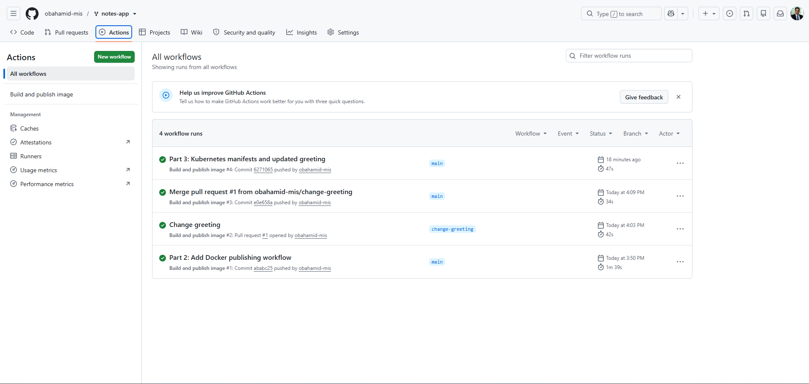
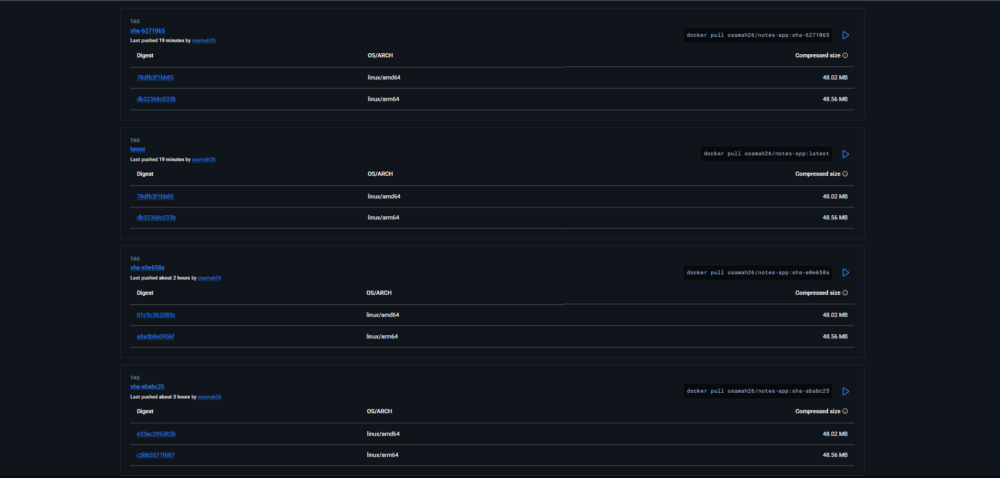

# Lab 5 Evidence

Repository: https://github.com/obahamid-mis/notes-app

Local cluster: Docker Desktop Kubernetes.

## GitHub Actions



## Docker Hub



## Running Kubernetes resources

Command: `kubectl get all,pvc`

```text
NAME                       READY   STATUS    RESTARTS
pod/db-6497dc696c-xtfsl     1/1     Running   0
pod/web-6849fc88f7-55cnk    1/1     Running   0
pod/web-6849fc88f7-5x49j    1/1     Running   0

NAME          TYPE        CLUSTER-IP       EXTERNAL-IP   PORT(S)
service/db    ClusterIP   10.98.8.42       <none>        5432/TCP
service/web   ClusterIP   10.109.162.199    <none>        80/TCP

NAME                  READY   UP-TO-DATE   AVAILABLE
deployment.apps/db    1/1     1            1
deployment.apps/web   2/2     2            2

NAME                             DESIRED   CURRENT   READY
replicaset.apps/db-6497dc696c     1         1         1
replicaset.apps/web-589bbb8bcd    0         0         0
replicaset.apps/web-6849fc88f7    2         2         2
replicaset.apps/web-f86489bf8     0         0         0

NAME                            STATUS   VOLUME                                     CAPACITY   ACCESS MODES   STORAGECLASS
persistentvolumeclaim/db-data   Bound    pvc-937425ab-f499-45e9-b0da-31f13cc57b69   1Gi        RWO            hostpath
```

## Experiment 2: Data persistence

After deleting the database pod and waiting for its replacement to become ready, I ran:

```bash
curl http://localhost:8000/notes
```

Output:

```json
[{"body":"hello from kubernetes","created_at":"2026-09-30T00:54:30.832859+00:00","id":1},{"body":"I should survive a pod deletion","created_at":"2026-09-30T00:59:22.212761+00:00","id":2}]
```

Both notes survived. The replacement database pod reused the persistent volume through the `db-data` PersistentVolumeClaim.

## Experiment 3: Load balancing

With four web replicas, I ran:

```bash
kubectl run curl --rm -it --restart=Never --image=curlimages/curl -- \
  sh -c 'for i in 1 2 3 4 5 6 7 8; do curl -s http://web/; echo; done'
```

Output:

```json
{"message":"Hello from Osamah's notes app!","served_by":"web-6849fc88f7-l79hg","service":"notes-app"}
{"message":"Hello from Osamah's notes app!","served_by":"web-6849fc88f7-hbdsq","service":"notes-app"}
{"message":"Hello from Osamah's notes app!","served_by":"web-6849fc88f7-hbdsq","service":"notes-app"}
{"message":"Hello from Osamah's notes app!","served_by":"web-6849fc88f7-5czrt","service":"notes-app"}
{"message":"Hello from Osamah's notes app!","served_by":"web-6849fc88f7-l79hg","service":"notes-app"}
{"message":"Hello from Osamah's notes app!","served_by":"web-6849fc88f7-l79hg","service":"notes-app"}
{"message":"Hello from Osamah's notes app!","served_by":"web-6849fc88f7-5wldn","service":"notes-app"}
{"message":"Hello from Osamah's notes app!","served_by":"web-6849fc88f7-5czrt","service":"notes-app"}
```

Four distinct `served_by` values show requests reaching all four web pods. I then scaled the Deployment back to two replicas.

## Experiment 4: Rolling update and rollback

I deployed `osamah26/notes-app:sha-6271065` and waited for the rollout to finish.

Command: `kubectl rollout history deployment/web`

Output after the update:

```text
deployment.apps/web
REVISION  CHANGE-CAUSE
1         <none>
2         <none>
3         <none>
```

The updated app returned:

```json
{"message":"Hello from Osamah's updated Kubernetes app!","served_by":"web-589bbb8bcd-xz59w","service":"notes-app"}
```

I ran `kubectl rollout undo deployment/web` and waited for the rollback to finish. The original greeting returned:

```json
{"message":"Hello from Osamah's notes app!","served_by":"web-6849fc88f7-5x49j","service":"notes-app"}
```

Rollout history after rollback:

```text
deployment.apps/web
REVISION  CHANGE-CAUSE
1         <none>
3         <none>
4         <none>
```